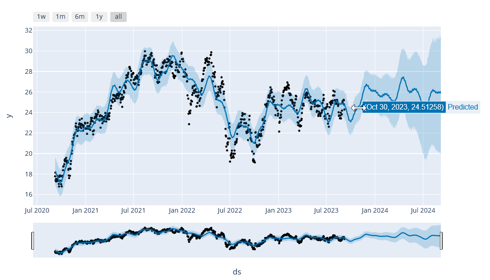

# fbprophet Stock Price Prediction (experimental)

Jono's early, rough exerimentation using Facebook Prophet AI to predict stock trends based
on past data. This might be useful to predict future ex-dividend dates or to backtest to
see how well predictions would have performed, but I wouldn't rely on it for stock prices!
Purely for testing, use at your own risk.

Based on the open source library here:

https://github.com/facebook/prophet

# Requirements
- Only tested under Windows Powershell at this point in time
- Python Poetry

# Installation

Firstly, install Python Poetry following [their docs](https://python-poetry.org/docs/)

Then clone this repo to a folder on your local machine:

    git clone https://github.com/jstucken/fbprophet.git

Change directory into your cloned local repo folder e.g.

    cd C:\fbprophet

Install the Python dependancies using Poetry:

    poetry install

Run the script:

    poetry run python fbprophet.py

Upon completion, the script will output an interactive chart you can view in your local browser e.g.

Black dots = actual data from Yahoo Finance
Blue lines = predicted values